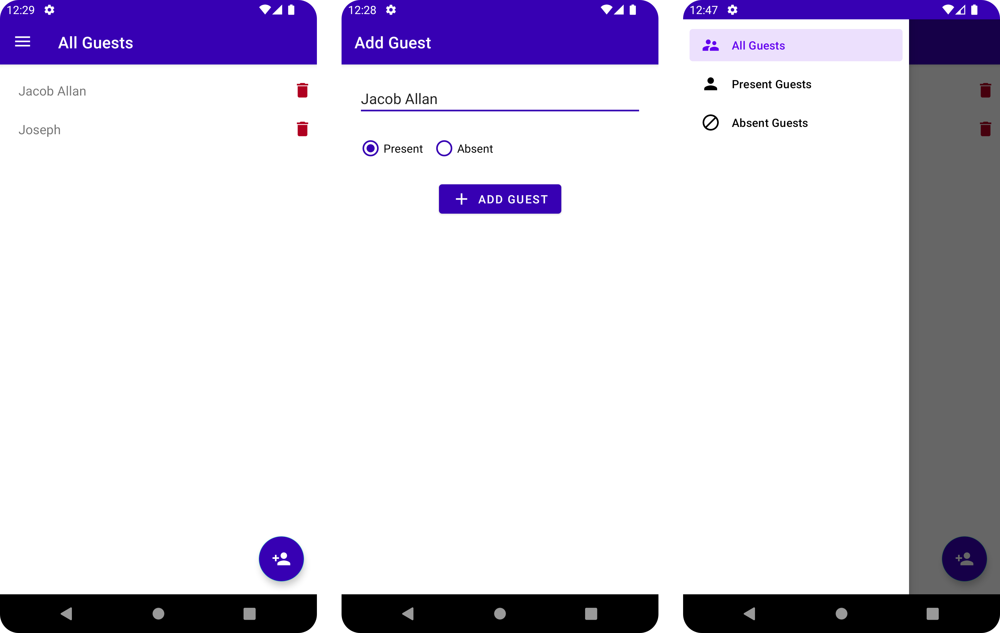

## Guests Android App

Android Guests is a simple project to showcase basics concepts of native development with Kotlin.<br>
In this project you'll find: 

- Local storage with `ROOM`
- Navigation Drawer
- MVVM Architecture
- Jetpack Components
- Constraint Layout and LinearLayout
- RecyclerView

###  Opening the project

Clone this repository in a terminal with

```
git clone https://github.com/WillACosta/guests_android_app 
```

To build this project, use the `gradlew build` command or open with Android Studio 
and use `Import Project`.

### Screenshots

<div style="margin: 0 auto">
    
</div>